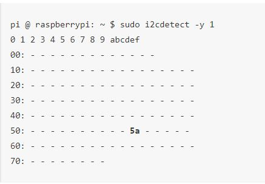

# ir-sensor-raspberryPi4

## Description

This README covers how to get started on connecting a stand alone ir-temp sensor to a rassberry-pi4. Motivated to learn and explore new interest. i managed to find a couple sources that helped along the way, created by other users. i created this to maybe help another curious user along their way.

[link to the sensor i used](https://www.amazon.com/dp/B07YZVDWWB?psc=1&ref=ppx_yo2_dt_b_product_details)
 

Check Tempatures with python, using MLX90614 contactless infrared-sensor Wired to a rassbery pi-4.

## Table of Contents 
- [Description](#description)
- [Installation](#installation)
- [Establish remote access](#establish-remote-access)
- [Wire the Sensor to the raspberry Pi](#wire-the-sensor-to-the-raspberry-pi)
- [Test sensor](#test-sensor)
- [Usage](#usage)
- [Credits](#credits)
- [License](#license)

## Installation
What are the steps required to create the IR-Thermometer? 

before any of the wiring starts, figuring out how to communicate with the raspberry pi is important. pluging into the monitor can be a major inconvince at times. 

### Establish remote access

-  Remote Access by using SSH and Putty
[Raspberry Pi Tutorials: Remote Access by using SSH and Putty](https://tutorials-raspberrypi.com/raspberry-pi-remote-access-by-using-ssh-and-putty/) 

- Establish a Raspberry Pi Remote Desktop Connection
[Raspberry Pi Tutorials: How to establish a Raspberry Pi Remote Desktop Connection]()

### Wire the Sensor to the raspberry Pi

 

open in google chrome to use translate, unless you know German [ Raspberry Pi Tutorials: : MLX90614 - Measure temperatures contactless with the Raspberry Pi](https://tutorials-raspberrypi.de/raspberry-pi-mlx90614-kontaktlos-temperatur-messen/)
but is the guide that helped me most and included the image above 
 

| MLX-Sensor | Raspberry-Pi |
| --- | --- |
| VIN | 5V (PIN 2 ) |
| GND | GND (PIN 6) |
| SCL | GPIO (PIN 5) |
| SDA | GPIO (PIN 3) |

### Test sensor

To be able to test the sensor we first have to enable I2C.
this is what the pi uses to communicate with our sensor open the terminal via remote desktop or a ssh connection. 

 --------
    sudo raspi-config
 -------

this will open up sudo a Raspberry Pi Software Configuration Tool menu.  go to "3 Interfacing Options".

| Raspberry Pi Software Configuration Tool (raspi-config)||
| --- | --- |
| 1 System Options      | Configure system settings                  |
| 2 Display Options     | Configure display settings                 |
| 3 Interface Options   | Configure connections to peripherals       |
| 4 Performance Options  | Configure performance settings            |
| 5 Localisation Options | Configure language and regional settings  |
| 6 Advanced Options    | Configure advanced settings                |
| 8 Update              | Update this tool to the latest version     |
| 9 About raspi-config  | Information about this configuration tool  |

 

another menu will come up

 

| Raspberry Pi Software Configuration Tool | |          
| --- | --- |
| P1 Camera      | Enable/disable connection to the Raspberry Pi Camera       |
| P2 SSH         | Enable/disable remote command line access using SSH        |
| P3 VNC         | Enable/disable graphical remote access using RealVNC       |
| P4 SPI         | Enable/disable automatic loading of SPI kernel module      |
| P5 I2C         | Enable/disable automatic loading of I2C kernel module      |
| P6 Serial Port | Enable/disable shell messages on the serial connection     |
| P7 1-Wire      | Enable/disable one-wire interface                          |
| P8 Remote GPIO | Enable/disable remote access to GPIO pins                  |

 this time go to "p5 I2C Enable/disable automatic loading of I2C kernel module" we want to "Enable". after this is completed.  <mark>Reboot the Pi!<mark> 

 now we can finally test if the sensor is at least being detected by our pi. once again open terminal, and type..

 ----------
    pi @ raspberrypi: ~ $ sudo i2cdetect -y 1
 -----------
Result should look like this:

---
If you do not see "5a" then check your connections. I had a similar issue, sensor pins(too short) werent making correct contact with the bread board. used a hair tie, while a sodder iron came in the mail. now it works great no issues. 

## How To Use

now that the MLX-sensor is detected, we can tell it what to do with python. 
i followed a great video Tutorial and used the code in the tutorial, i am new to python and using a raspberry pi.

[Great Video Tutorial ](https://www.youtube.com/watch?v=CftxT8k0jww) 
 
[link to code used in the video tutorial](https://raw.githubusercontent.com/STJRush/handycode/master/ALT4%20Sensors%20Inputs%20Outputs/Raspberry%20PI%20Sensors/MLX90614%20Infrared%20Thermal%20Sensor/MLX90614_Therm_Sensor.py)

- open Thonny Python IDE on the PI using remote desktop view. paste your code there and save it where you can get to it. you are going to need to import those packages 

to install those packages i found it easiest to go into the thonny python IDE. Tools- Manage Packages.
there a interface will pop up, install from there.

#### Packages:
 - Adafruit-Blinka
 - adafruit-circuitpython-mlx90614  
------
## dectect Tempatures!
 simply point the sensor and run code!

## Credits
Raspberry Pi Tutorials website was huge help
-  Remote Access by using SSH and Putty
[Raspberry Pi Tutorials: Remote Access by using SSH and Putty](https://tutorials-raspberrypi.com/raspberry-pi-remote-access-by-using-ssh-and-putty/) 

- open in google chrome to use translate, unless you know German [ Raspberry Pi Tutorials: : MLX90614 - Measure temperatures contactless with the Raspberry Pi](https://tutorials-raspberrypi.de/raspberry-pi-mlx90614-kontaktlos-temperatur-messen/)

- Establish a Raspberry Pi Remote Desktop Connection
[Raspberry Pi Tutorials: How to establish a Raspberry Pi Remote Desktop Connection]()
 
Youtube:
 
Danny Murray 
- [MLX90614 Thermal Sensor Raspberry Pi Tutorial](https://www.youtube.com/watch?v=CftxT8k0jww)

- [code used in his video](https://raw.githubusercontent.com/STJRush/handycode/master/ALT4%20Sensors%20Inputs%20Outputs/Raspberry%20PI%20Sensors/MLX90614%20Infrared%20Thermal%20Sensor/MLX90614_Therm_Sensor.py)

## License

---

## How to Contribute

If i got something wrong or maybe theres a better way contact me
jose22gw@gmail.com
